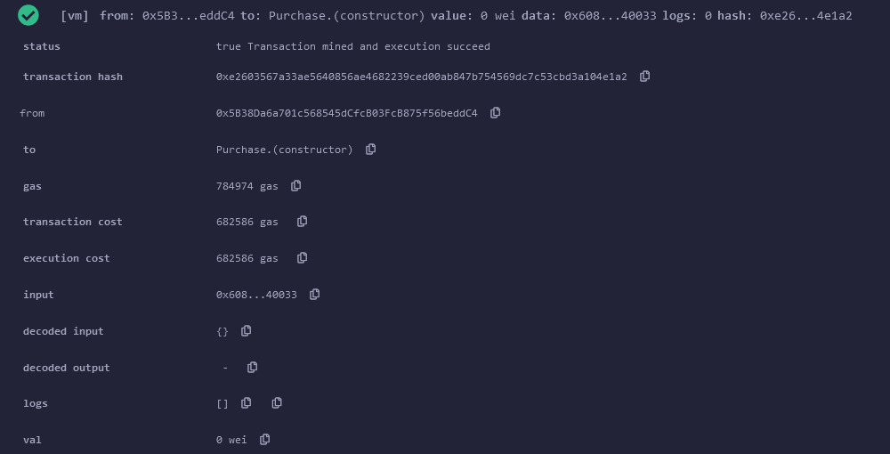
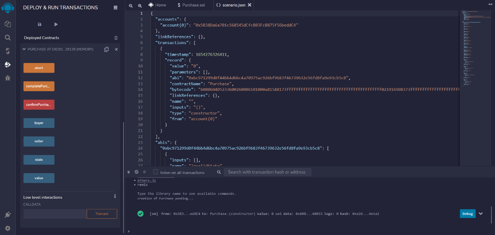
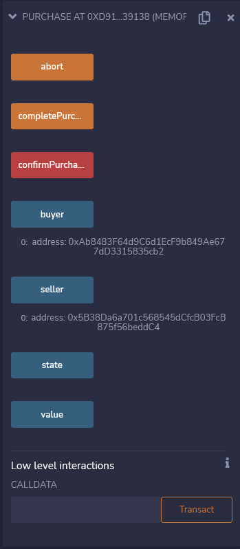
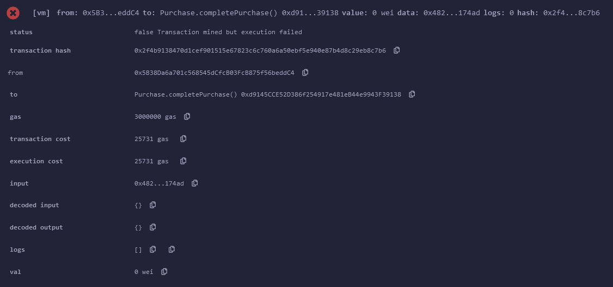
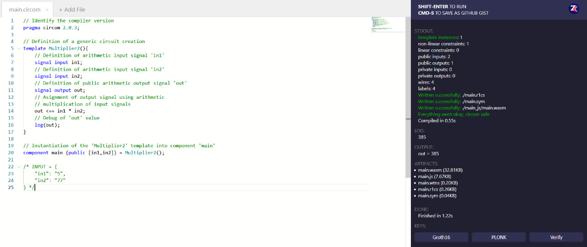
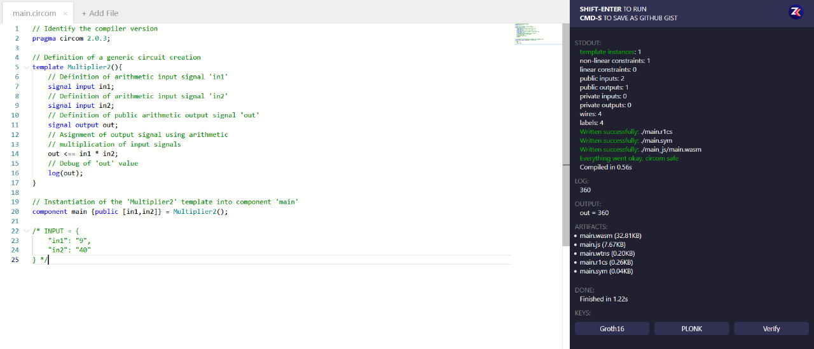

# zku-assignment

## SOL

### Contract Deployment

### Contract deployment details with timestamp

### Buyer and Seller addresses

### Seller tryes to confirm before 5 minutes

### Error log

### Seller tryes to confirm after 5 minutes

## CIRCOM

### Default circuit execution

### Modified circuit execution - As expected

